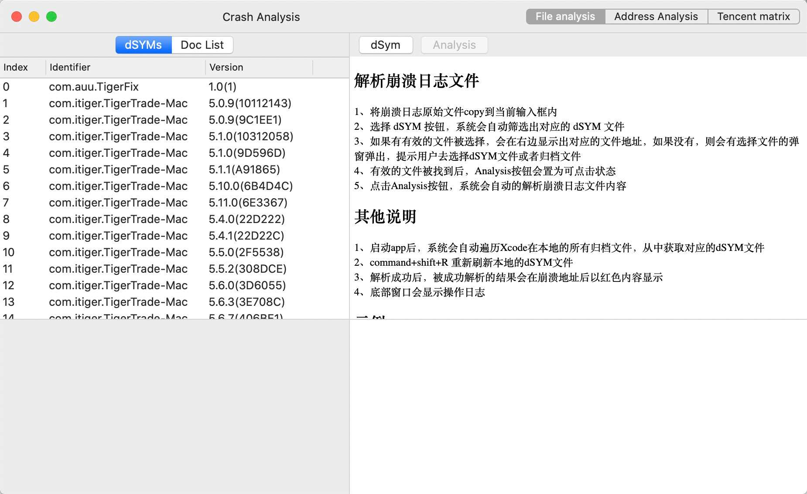

# 崩溃解析辅助工具

## 1. 页面说明



1. 状态栏右侧可以切换分析崩溃信息的方式，有以下几种：
    - 直接分析崩溃日志文件
    - 按崩溃内存地址自己按条的去解析崩溃信息
    - Tencent matrix框架收集到的崩溃信息可视化显示工具
2. 左侧是列表导航页面
    - 崩溃信息辅助页面，上部分是dSYM文件列表，下部分是选中dSYM后的概要信息
    - 辅助文档列表(待接入)
3. 在切换分析方式后，会切换右上方的显示
4. 右下方是日志输出页面，所有操作的记录都可以输入到这里，右键可以选择情况日志内容

## 2. 崩溃文件解析

**使用说明**

1. 将[崩溃日志原始文件](./res/diagnostic_crash_file.md)copy到当前输入框内
2. 选择 dSYM 按钮，系统会自动筛选出对应的 dSYM 文件
3. 如果有有效的文件被选择，会在右边显示出对应的文件地址，如果没有，则会有选择文件的弹窗弹出，提示用户去选择dSYM文件或者归档文件
4. 有效的文件被找到后，Analysis按钮会置为可点击状态
5. 点击Analysis按钮，系统会自动的解析崩溃日志文件内容

**其他说明**

1. 启动app后，系统会自动遍历Xcode在本地的所有归档文件，从中获取对应的dSYM文件
2. command+shift+R 重新刷新本地的dSYM文件
3. 解析成功后，被成功解析的结果会在崩溃地址后以红色内容显示
4. 底部窗口会显示操作日志

**示例**
自动解析后会在需要解析的内存地址后拼上解析后的内容，即红色部分：


## 3. 崩溃内存地址解析

给使用者提供自己主动解析崩溃内存地址的工具，如图：


```
    Thread 0 name:  Dispatch queue: apple.main-thread
    Thread 0 Crashed:
    0   libsystem_kernel.dylib          0x3618da1c 0x3617c000 + 72220 (__pthread_kill + 8)
    1   libsystem_c.dylib               0x3625cbf8 0x36231000 + 179192 (abort + 72)
    2   Crash-Tester                    0x000668a8 0x5f000 + 30888
    3   Crash-Tester                    0x00065628 0x5f000 + 26152
    4   Crash-Tester                    0x00065d50 0x5f000 + 27984
    5   Crash-Tester                    0x00066400 0x5f000 + 29696
    6   UIKit                           0x31634518 0x315e0000 + 345368 (-[UITableView _selectRowAtIndexPath:animated:scrollPosition:notifyDelegate:] + 660)
    7   UIKit                           0x316980e8 0x315e0000 + 753896 (-[UITableView _userSelectRowAtPendingSelectionIndexPath:] + 128)
    8   Foundation                      0x34e366d0 0x34db1000 + 546512 (__NSFireDelayedPerform + 364)
    9   CoreFoundation                  0x31555a40 0x314e0000 + 481856 (__CFRUNLOOP_IS_CALLING_OUT_TO_A_TIMER_CALLBACK_FUNCTION__ + 8)
    10  CoreFoundation                  0x31557ec8 0x314e0000 + 491208 (__CFRunLoopDoTimer + 848)
    11  CoreFoundation                  0x31558840 0x314e0000 + 493632 (__CFRunLoopRun + 1084)
    12  CoreFoundation                  0x314e8ec0 0x314e0000 + 36544 (CFRunLoopRunSpecific + 228)
    13  CoreFoundation                  0x314e8dc8 0x314e0000 + 36296 (CFRunLoopRunInMode + 56)
    14  GraphicsServices                0x30e67418 0x30e63000 + 17432 (GSEventRunModal + 108)
    15  GraphicsServices                0x30e674c8 0x30e63000 + 17608 (GSEventRun + 60)
    16  UIKit                           0x3160ed68 0x315e0000 + 191848 (-[UIApplication _run] + 404)
    17  UIKit                           0x3160c800 0x315e0000 + 182272 (UIApplicationMain + 664)
    18  Crash-Tester                    0x000607b8 0x5f000 + 6072 <font style="color:#ff0000">main + 164</font>
```

如上的崩溃信息中，在崩溃线程的第`2`、`3`、`4`、`5`行的调用即为当前项目的崩溃，可以看到在其他行的调用中，内存地址右侧有项目中对应的代码信息，当时这几行没有，这就是需要解析的内存地址，如：
```
2   Crash-Tester                    0x000668a8 0x5f000 + 30888
```
其中`0x5f000`为偏移地址，`0x000668a8`崩溃地址。
找到需要的信息填入各输入框，然后选择对应的dSYM文件，再点击右侧的解析按钮即可。
其中，左侧为辅助页面，不参与任何解析操作；右侧为解析内容输出页面，每次使用者主动点击解析后，都会在其中做下记录。

## 4. Tencent matrix 收集到的文件解析

**[Tencent matrix](https://github.com/Tencent/matrix)**框架收集到的信息可以见[示例](./res/diagnostic_matrix_file.md)。
收集到的信息都是JSON格式的，但是直观的展示样式比较难以辨认，可以把收集到的JSON信息，填入左侧输入框中，然后点击上部分的解析按钮即可在右边的列表视图中展示格式化好的信息列表。在选择行格式化信息后就会在下方显示对应格式化的内容和原始数据。


## 5. 相关信息

### 1）归档文件地址

每次打包后都会在本地生成一个归档文件，所有归档文件都在[/Library/Developer/Xcode/Archives/](file:///Library/Developer/Xcode/Archives/)目录下，而dSYM文件则在归档文件中的`dSYM`目录下。

### 2）解析dSYM文件对应的uuid和架构

```
调用指令：dwarfdump --uuid {{dsym 文件地址}}
解析结果：UUID: EE396B01-3C64-33E6-BFD1-26C2C41C0ED2 (x86_64) {{DWARF 文件地址}}
```
对解析结果使用正则解析：`UUID:\s+([\w-]+)\s+\((\w+)\)\s+(.+)$`
- 分组1：uuid
- 分组2：架构类型
- 分组3：DWARF文件地址

### 3）解析崩溃内存地址对应的代码

```
调用指令：xcrun atos -arch {{arch}} -o \"{{dwarfFile}}\" -l {{slideAddress}} {{crashAddress}}
```
如果信息成功选择，执行后即可得到解析后的内容。